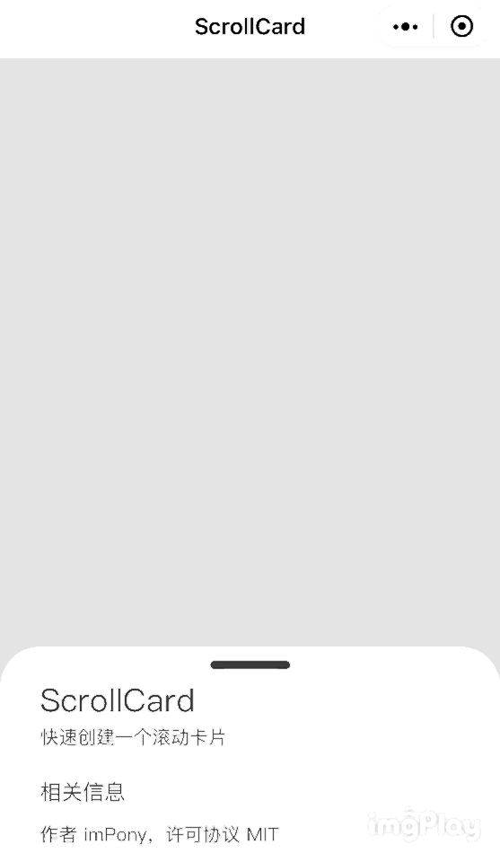

## ScrollCard
### 快速创建一个滚动卡片

目前许多手机应用都使用了这种设计，使用 ScrollCard 的代码可以在微信小程序中快速的创建一个类似交互的卡片。

立即把项目下载下来，然后把 `project.config.json` 中的 `appid` 改为自己的试试吧。

#### 相关信息

作者 imPony，许可协议 MIT

#### 效果说明

手指上下滑动，可以滚动这个卡片；点击卡片顶部可以快速的展开或收起卡片。

#### 注意

需要给主内容区 `scrollcard-main` 一个 `padding-bottom` 值，具体值等于 `scrollcard-ctrl` 的高度，否则会有部分内容显示不全。

#### 原理解释

ScrollCard 主要使用了微信小程序的 `scroll-view` 组件，然后结合 CSS 的位置控制，从而实现视觉上的效果，几乎没有用到 Javascript（如果不需要点击卡片顶部快速展开或收起卡片，那么就完全不需要用到 Javascript）。

#### 更新日志

0.1.0

「实现」滚动卡片功能

「实现」卡片快速展开或收起功能
